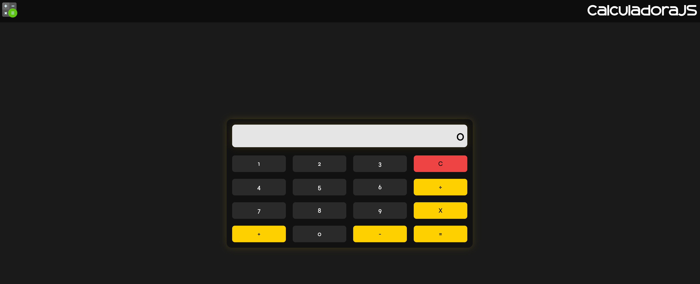

# 💎 ・ CALCULATOR
A simple basic calculator built using HTML, CSS, and JavaScript. This project focuses on fundamental front-end concepts such as DOM manipulation, event handling, and basic arithmetic logic implementation.

The calculator supports standard operations including addition, subtraction, multiplication, and division, providing instant results based on user input. The interface is structured with a straightforward and functional layout, prioritizing clarity and usability over responsive design or advanced UI behavior.

This project serves as a solid introduction to interactive web development, demonstrating how JavaScript can be used to control user input and update the interface dynamically in real time. Ideal as a beginner exercise and a foundation for future improvements such as responsive design, keyboard support, or enhanced features.

# 💠 ・ TABLE OF CONTENTS
- [Calculator](#-calculator)
- [Preview](#-preview)
- [Links](#-links)
- [Technologies](#-technologies)
- [Project Structure](#-project-structure)
- [Getting Started](#-getting-started)
- [Features](#-features)
- [Author](#-author)
- [License](#-license)

# 💠 ・ PREVIEW


# 💠 ・ LINKS
- [GitHub](https://github.com/marcospmtech/calculator)
- [Demo](https://marcospmtech.github.io/calculator)

# 💠 ・ TECHNOLOGIES
- HTML5
- CSS3
- JavaScript
- DOM
- Grid

# 💠 ・ PROJECT STRUCTURE
```
/calculator
│
├── index.html
├── README.md
├── LICENSE
├── .gitignore
│
├── /src
│   ├── /fonts
│   │   ├── Gunken.woff
│   │   ├── Gunken.woff2
│   │   ├── Syne.woff
│   │   └── Syne.woff2
│   │
│   ├── /icons
│   │   ├── favicon.ico
│   │   └── logo.png
│   │
│   ├── /img
│   │   └── calculator-preview.png
│   │
│   └── /theme
│       └── palette.json
│
├── /js
│   └── script.js
│
└── /style
    └── style.css
```

# 💠 ・ GETTING STARTED

### Installation

Clone the repository:
```
git clone https://github.com/marcospmtech/calculator
```

Navigate to the project folder:
```
cd calculator
```

### Usage

- Open ```index.html``` in you browser

or

- Use live server (recommended)


# 💠 ・ FEATURES

- Basic arithmetic operations: addition, subtraction, multiplication, and division
- Real-time calculation with instant result updates
- Clear and delete functionality for better input control
- Simple and intuitive user interface
- Keyboard-free interaction using clickable buttons
- Lightweight and fast performance with no external dependencies

# 💠 ・ AUTHOR

Developed by *Marcos P. Monea*

- <a href="https://github.com/marcospmtech" target="_blank" rel="noopener noreferrer">GitHub</a>
- <a href="https://linkedin.com/in/marcostech" target="_blank" rel="noopener noreferrer">LinkedIn</a>
- <a href="mailto:marcos.monea@yahoo.com.br" target="_blank" rel="noopener noreferrer">E-mail</a>

# 💠 ・ LICENSE
This project is open-source and licensed under the MIT License, which allows anyone to use, copy, modify, and distribute this software. See the full license in the LICENSE file.